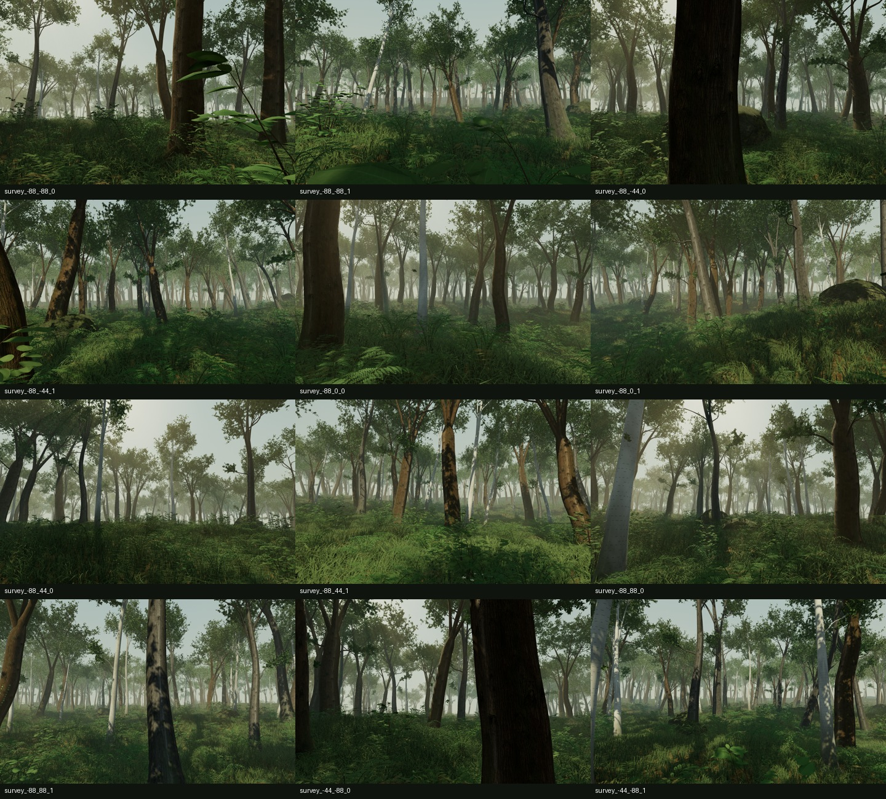

# Verdant Forest · Showcase

A runnable case study of a dense, procedural Three.js woodland: **3,808 trees,
2.53 million grass clumps, and 39,598 ferns** in the desktop scene.

This is an attributed showcase fork of **[Leon Lin’s Verdant Forest](https://github.com/Leonxlnx/verdant-forest)**,
shared in [this X post](https://x.com/LexnLin/status/2099515451881496700).
Leon’s [original demonstration](https://x.com/LexnLin/status/2096263046918197609)
describes giving GPT 6 Astra roughly five hours to build the forest.
That account is the author’s report; this repository makes the resulting code easy to explore.

**[Explore the live forest ↗](https://forest.whyjs.com)**
· **[Author’s original demo](https://verdant-forest.lexn8.chatgpt.site)**
· **[Read the case study](docs/case-study.md)**
· **[Asset credits](public/credits.txt)**



*Preview from the original project’s offline scene-data renderer. It is not a browser
screenshot or a performance benchmark. The AWS showcase and the author’s original
demo are separate deployments of the same forest.*

## Run locally

Use **Node.js 22.13 or newer** and npm. Node 22 is pinned in `.nvmrc`.
A browser with WebGL 2 and hardware acceleration is needed to explore the scene.
No API key, account, database, or AI service is required to run it.

```bash
git clone https://github.com/AlexLisong/verdant-forest-showcase.git
cd verdant-forest-showcase
nvm use                         # optional, if you use nvm
npm run install:ci
npm run dev
```

Open the local URL printed by Vite (normally `http://127.0.0.1:5173`).
Initial scene construction can take tens of seconds; keep the tab open while
“Entering the forest” is visible. This is a GPU-intensive demo.

```bash
npm run typecheck               # TypeScript verification
npm run build                   # production build into dist/
npm run start                   # serve the production build locally
npm run test:controls           # nine deterministic camera/input checks
npm test                        # build, rendered-page/component tests, and controls
```

The normal commands use portable npm/Node tooling. The original Linux-only
scripts remain under `scripts/` as upstream reference and are not required for
installation or building this fork. CI runs the locked install, type check,
production build, rendered-page/component tests, and control checks on every push
and pull request.

## Explore

| Input | Action |
| --- | --- |
| Drag | Look around |
| W / A / S / D or arrow keys | Move |
| Q / E | Descend / rise |
| Space | Rise |
| Shift | Move faster |
| Mouse wheel | Travel along the viewing direction |
| R | Return to the trail entrance |
| Double-click / Escape | Capture / release the pointer |
| Touch: left thumb / right side | Move / look |
| Touch: flight buttons | Change height |

The scene honors reduced-motion preferences by disabling vegetation wind and
drifting particles. Touch devices use smaller textures and reduced vegetation density.

## What makes this case interesting

- **Geometry, not a video:** curved grass, folded leaves, branching trees, ferns,
  roots, moss, ivy, deadwood, and litter are generated and rendered in real time.
- **Scale through reuse:** shared geometry, instanced placement, compact attributes,
  distance-based detail, and adaptive render resolution keep the scene manageable.
- **A layered lighting pipeline:** physically based materials, directional shadows,
  contact occlusion, fog, and depth-bounded atmospheric scattering.
- **Evidence included:** the upstream project preserves geometry audits, shader
  checks, material studies, and the record of a real WebGL shader repair.

See [the case study](docs/case-study.md) for source pointers, measured scene counts,
and the distinction between upstream evidence and this fork’s checks.

## Source map

| Location | Responsibility |
| --- | --- |
| [`app/page.tsx`](app/page.tsx) | Full-screen scene, loading and error states |
| [`app/forest/engine.ts`](app/forest/engine.ts) | Renderer lifecycle, lighting, adaptive resolution |
| [`app/forest/vegetation.ts`](app/forest/vegetation.ts) | Vegetation placement, instancing and detail levels |
| [`app/forest/trees.js`](app/forest/trees.js), [`understory.js`](app/forest/understory.js) | Botanical mesh generation |
| [`app/forest/volumetrics.ts`](app/forest/volumetrics.ts) | Atmospheric and contact-occlusion shader passes |
| [`app/forest/controls.ts`](app/forest/controls.ts) | Desktop and touch exploration |
| [`app/forest/surfaces.ts`](app/forest/surfaces.ts), [`details.ts`](app/forest/details.ts), [`trunk-life.ts`](app/forest/trunk-life.ts) | Terrain and forest-floor detail |
| [`public/textures/`](public/textures/) | Local PBR textures, including smaller mobile maps |
| [`scripts/`](scripts/), [`artifacts/`](artifacts/), [`gates/`](gates/) | Upstream inspection tools and historical evidence |

## Provenance and reuse

Original source: `Leonxlnx/verdant-forest` at
[`4252ffd`](https://github.com/Leonxlnx/verdant-forest/commit/4252ffd515f86316e165cc083a258fda80b6dc9b).
The forest implementation and original Git history are preserved.
This fork adds setup improvements, documentation, and CI; it does not claim authorship
of Leon’s forest or repeat the original generation experiment.

The upstream repository did not include a top-level source-code license at the time
of import. This fork does not add or imply a license for that code.
Poly Haven texture sets are CC0; Three.js is MIT. See [asset credits](public/credits.txt)
and the dependencies’ own licenses for their terms.

The upstream Sites project identifier has been removed from active configuration.
This fork uses [the existing Linux server with Nginx](docs/aws-deployment.md),
deployed with AWS CLI profile `lighthouse`. Historical deployment records in `artifacts/`
and `gates/` describe the author’s project, not this fork. The
[original README](docs/upstream-readme.md) is retained for context; its relative
paths refer to the repository root.
