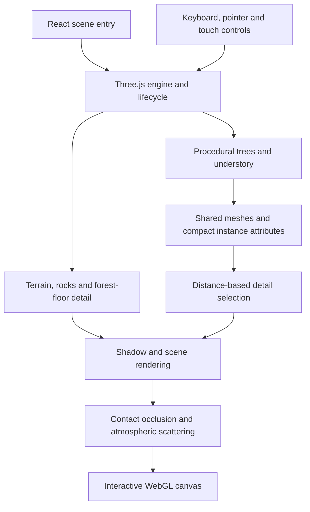

# Case study: a procedural forest at browser scale

## Reference

On September 14, 2026, [Leon Lin shared the source](https://x.com/LexnLin/status/2099515451881496700)
for [Verdant Forest](https://github.com/Leonxlnx/verdant-forest). His
[September 5 demonstration](https://x.com/LexnLin/status/2096263046918197609)
described a roughly five-hour GPT 6 Astra session producing a detailed Three.js
forest with custom shaders. The source is available for inspection; the generation
duration is the author’s statement, not a measurement made by this fork.

This showcase preserves that implementation and gives readers a reproducible local
entry point. The AI work happened while authoring the scene. Exploring the finished
application does not call an AI model.

## What is actually in the scene?

These counts come from the upstream
[`memory-desktop.json`](../artifacts/memory-desktop.json) and
[`memory-coarse.json`](../artifacts/memory-coarse.json) audits, which construct the
scene in Node. They count generated instances, not necessarily objects drawn in
every frame.

| Element | Desktop | Touch/coarse-pointer |
| --- | ---: | ---: |
| Trees | 3,808 | 3,808 |
| Grass clumps | 2,529,528 | 1,154,423 |
| Ferns | 39,598 | 26,382 |
| Shrubs | 4,341 | 3,160 |
| Herbs | 43,953 | 27,500 |
| Moss shoots | 214,811 | 124,480 |
| Root systems | 356 | 356 |

The same audits report about **322 MiB** of unique geometry/instance buffers on
desktop and **217 MiB** on the coarse-pointer configuration. These figures exclude
textures, render targets, browser overhead, and graphics-driver allocations. They
are not total application memory or a promise of device performance.

## How the pieces fit together



1. [`engine.ts`](../app/forest/engine.ts) creates the renderer, camera, lighting,
   resources, and frame loop, then cleans them up on unmount or abort.
2. [`vegetation.ts`](../app/forest/vegetation.ts) generates and places the botanical
   meshes. [`compact-grass.ts`](../app/forest/compact-grass.ts) and
   [`geometry-memory.ts`](../app/forest/geometry-memory.ts) reduce buffer cost.
3. The renderer updates detail with camera position and lowers pixel ratio when
   observed frame rate drops. Touch devices use a smaller initial budget.
4. [`volumetrics.ts`](../app/forest/volumetrics.ts) combines the lighting and
   atmosphere passes. Wind and particles respect reduced-motion preferences.

## A useful failure preserved in the record

The upstream history includes a shader-startup repair: a GLSL identifier named
`patch` was accepted by one inspection path but rejected as a reserved word by the
WebGL shader compiler. The repair renamed it, advanced the shader cache key, and
preserved driver diagnostics.

[`gates/shader-fix.md`](../gates/shader-fix.md) records **43/43 GLSL ES shader
programs** compiling and linking in Mesa. This is historical upstream evidence,
not a browser compatibility guarantee or a newly repeated result here. It
illustrates why a build or offline renderer alone cannot validate a WebGL scene.

## Reproduce the lightweight checks

After installation:

```bash
npm run typecheck
npm run build
npm run test:controls
```

The control audit covers movement, release damping, reset, drag look, blur reset,
terrain clearance, world bounds, concurrent touch inputs, and disposal. It uses a
deterministic event harness, not browser automation. Its preparation step writes
ignored intermediate modules under `artifacts/qa-modules/`.

Optional CPU scene audits can be rerun with:

```bash
node scripts/prepare-qa.mjs
node scripts/audit-memory.mjs
node scripts/audit-memory.mjs --coarse
```

Those commands rebuild a large scene and overwrite their corresponding audit JSON
files. The native offline rendering tools have separate Python/OpenGL requirements;
they are not needed to run the browser demo.

## Scope of this fork

- Preserves the original forest source, texture credits, and commit ancestry.
- Adds a Node 22 version file and portable npm entry points in place of the
  Linux-only installation/build wrappers.
- Documents controls, architecture, attribution, and evidence limitations.
- Adds GitHub Actions for locked installation, TypeScript, build, and control checks.
- Updates two leftover starter assertions to check the forest page and its styles;
  `npm test` also runs the nine camera/input checks.
- Removes the original author’s Sites deployment identity from active configuration.

The `PLAN.md`, `GATES.md`, `gates/`, and existing `artifacts/` files are upstream
historical records. Current CI results belong to this fork. The author's public
demo is linked for convenience; this repository does not manage that deployment.
This fork also provides a separate [AWS deployment](aws-deployment.md), using a
static export and a dedicated private S3 origin behind CloudFront.

## Showcase verification · September 14, 2026

Verified locally on macOS with Node 22.23.1:

| Check | Result |
| --- | --- |
| Locked dependency installation | Passed |
| TypeScript (`npm run typecheck`) | Passed |
| Production build | Passed |
| Rendered HTML and component/style tests | 5 passed |
| Camera/input audit | 9 passed |
| Local Vite endpoint | HTTP 200 |
| Chrome visual check | Forest rendered; trail, foliage and atmospheric lighting visible |
| Independent code review | No substantive issues found |

The browser check confirms visual startup on this machine. It is not a frame-rate
benchmark, mobile-device test, or cross-browser compatibility claim. Build output
retains the upstream warning about a JavaScript chunk larger than 500 kB.
